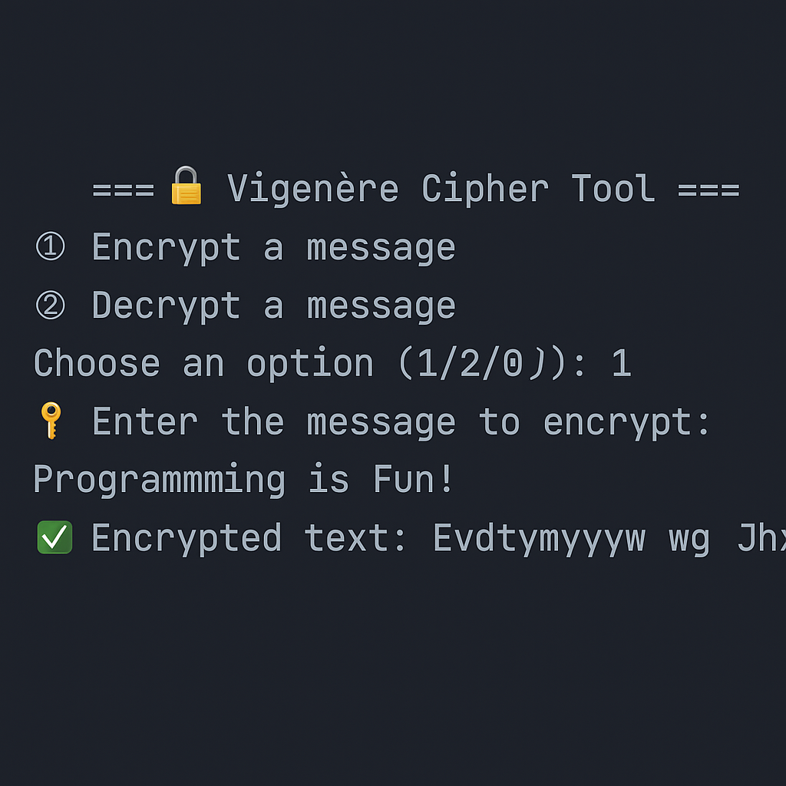
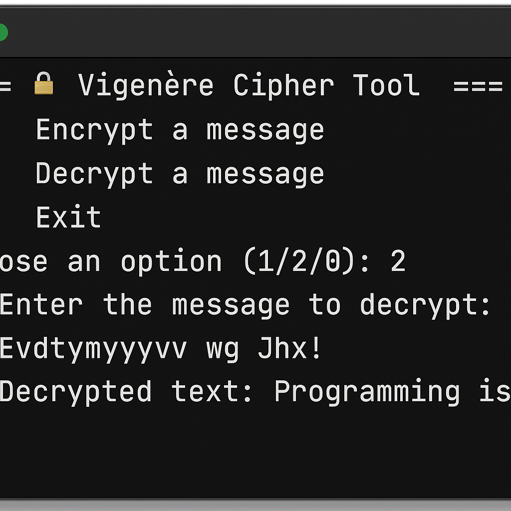

🔐 Vigenère Cipher – Python Encryption & Decryption

This project implements the Vigenère Cipher, a classical cryptographic algorithm that encrypts and decrypts messages using a keyword-based shifting technique.

🚀 Features
✅ Encrypt and decrypt text messages

✅ Preserves uppercase and lowercase letters

✅ Keeps spaces and punctuation unchanged

✅ Interactive CLI with menu options

✅ Beginner-friendly, modular Python code

📂 Project Structure
bash
Copy
Edit
python_projects/
│── vigenere_cipher/
│   ├── main.py       # Main encryption/decryption script
│   ├── README.md     # Project documentation
│   └── LICENSE       # MIT License
│   └── screenshots/
│       ├── encrypt.png
│       └── decrypt.png
🛠️ Usage
Run the program:

bash
Copy
Edit
python main.py
💻 Example Output:
pgsql
Copy
Edit
=== 🔐 Vigenère Cipher Tool ===
1️⃣ Encrypt a message
2️⃣ Decrypt a message
0️⃣ Exit

Choose an option (1/2/0): 1
🔑 Enter the message to encrypt: Programming is Fun!
🔐 Enter the encryption key: Python

✅ Encrypted text: Evdtymyyywv wg Jhx!
## 🖼️ Demo

### 🔑 Encryption:

### 🔓 Decryption:

🧠 How It Works
Each letter is shifted by the corresponding character in the key.

Non-alphabetic characters remain unchanged.

Uses the same function for encryption and decryption with different shift directions.

📜 License
This project is licensed under the MIT License.

✅ Steps to Use This:
Create a folder screenshots/ inside your vigenere_cipher project.

Upload:

encrypt.png (encryption terminal screenshot)

decrypt.png (decryption terminal screenshot)

Commit → GitHub will automatically display them in the README.
